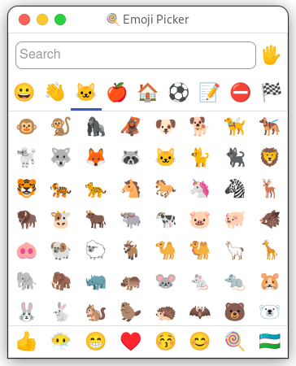
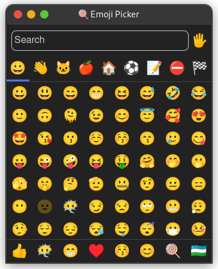

# 🍭 Simple Emoji Picker

Linux ecosystem lacks a minimal and straight forward way to pick emojis. Some options are an overkill, others require multiple steps to simply get emoji into a clipboard. This simple tool aims fill the gap. The interface relies on an awesome [nolanlawson/emoji-picker-element](https://github.com/nolanlawson/emoji-picker-element) project. [Webview](https://github.com/webview/webview) was used to bundle the whole application into a single executable file.

Only Linux is currently supported. The rest of the platforms are covered natively.

## 📥️ Installation

Download file from releases section and run it.

```bash
curl -o emoji-picker https://github.com/va1da5/simple-emoji-picker/releases/download/v0.0.1/emoji-picker

sudo mv emoji-picker /usr/local/bin/emoji-picker
```

## 🤗 Usage

Once started, simply click on an emoji to copy it to a clipboard. Paste it later in any text editor.

The binary can later be configured to be started using a [keyboard shortcut](https://docs.fedoraproject.org/en-US/quick-docs/proc_setting-key-shortcut/), like `Crtl+Super+Space`, to make the process easier and similar to MacOS.


### 🖼️ Screenshots





## 🧮 Development

The development of the utility could by done without Golang or Node environments when using Docker. [Makefile](./Makefile) contains all the commands to build executable using only containers. Please see details below.

```bash
make build-all
```

## 📝 Todo

- [x] Disable Windows resize option while keeping the preferred window size
- [ ] Start application window near a mouse cursor - *harder than one would expect*


## 🗂️ References

- [nolanlawson/emoji-picker-element](https://github.com/nolanlawson/emoji-picker-element)
- [Emoji Repository by Unicode Consortium](https://unicode.org/Public/emoji/)
- [github/gemoji](https://github.com/github/gemoji)
- [Webview Project](https://github.com/webview/webview)
- [Is it possible to use a local HTML file using Go and webview?](https://stackoverflow.com/questions/66813122/is-it-possible-to-use-a-local-html-file-using-go-and-webview)
- [How to create a native macOS app on Go (Golang) and React.js with full code protection](https://dev.to/koddr/how-to-create-a-native-macos-app-on-go-golang-and-react-js-with-full-code-protection-part-1-463k)
- [Gtk 4.0](https://docs.gtk.org/gtk4/index.html)
- [WebKit2GTK+ Reference Manual](https://webkitgtk.org/reference/webkit2gtk/stable/index-all.html)
- [Book: GTK4 for Graphical User Interfaces](https://ssalewski.de/gtkprogramming.html)
- [gotk3](https://github.com/gotk3/gotk3)
- [mattn/go-webkit/webkit.go](https://github.com/mattn/go-webkit/blob/master/webkit/webkit.go)
